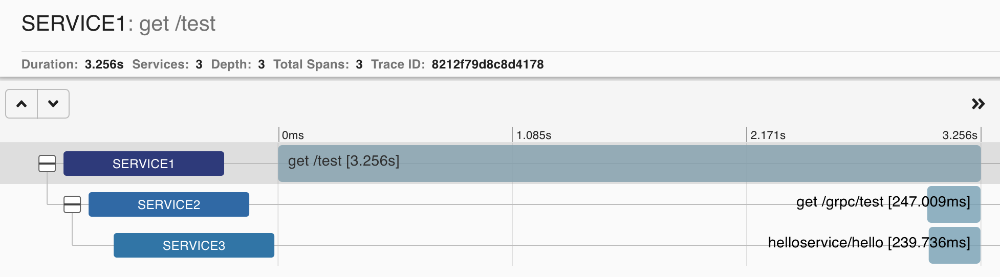

# zipkin_demo
Zipkin x Spring WebFlux x gRPC




[Quickstart](https://zipkin.io/pages/quickstart)
[Spring Cloud Sleuth](https://cloud.spring.io/spring-cloud-static/spring-cloud-sleuth/2.1.0.RELEASE/single/spring-cloud-sleuth.html)

Register `WebClient` as a bean and the tracing instrumentation gets applied.
```
@Bean
fun webClient(): WebClient {
    return WebClient.builder().build()
}
```

Use [brave-instrumentation-grpc](https://github.com/openzipkin/brave/tree/master/instrumentation/grpc) to enable tracing for a gRPC application.

Use [reactor-grpc](https://github.com/salesforce/reactive-grpc/tree/master/reactor) to go reactive with gRPC.
